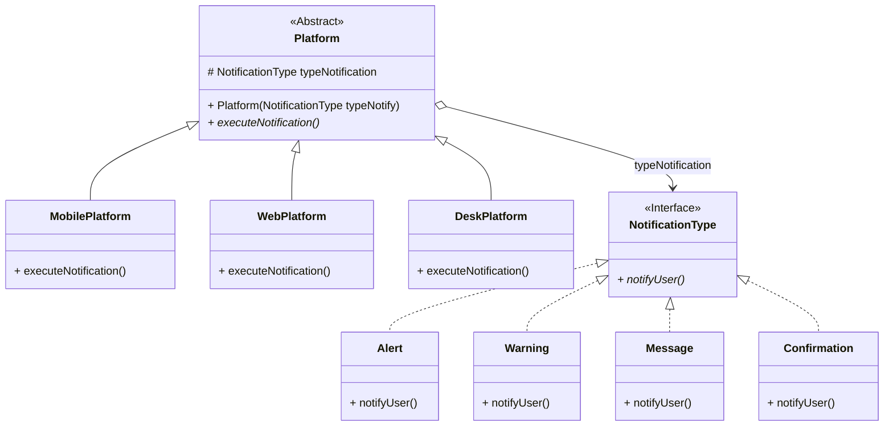

# Ejercicio 2: Plataforma de Notificaciones Multiplataforma

Este proyecto implementa un sistema para la gestión y visualización de notificaciones adaptadas a distintas plataformas (*Escritorio*, *Móvil*, *Web*) y con diversos tipos de mensaje (*Alerta*, *Advertencia*, *Mensaje*, *Confirmación*).

---

## 📌 Contexto y Problema

### Escenario
Se requiere desarrollar una aplicación capaz de enviar distintos tipos de notificaciones a diferentes plataformas tecnológicas. Cada tipo de notificación debe ser presentado adaptándose a la plataforma de destino elegida.

### Problema: Explosión Combinatoria de Clases
Al intentar resolver este problema con **herencia tradicional**, surge una multiplicación exponencial de subclases para cubrir cada combinación posible (por ejemplo: `NotificacionMensajeWeb`, `NotificacionAlertaWeb`, `NotificacionMensajeMovil`, etc.). Esto genera $M \times N = 3 \times 4 = 12$ clases concretas solo para el conjunto inicial, haciendo el sistema rígido y difícil de mantener a largo plazo.

---

## 💡 Solución: Patrón de Diseño Bridge (Puente)

Para evitar la explosión combinatoria, se aplica el patrón de diseño estructural **Bridge (Puente)**. Este patrón desacopla una **Abstracción** (las Plataformas) de su **Implementación** (los Tipos de Notificación), permitiendo que ambas jerarquías varíen de manera independiente.

### Diagrama de Estructura (Mermaid)



---

## 📁 Estructura del Código

```text
src/
├── Platform.java              # Abstracción base (Clase Abstracta)
├── MobilePlatform.java        # Abstracción refinada: Plataforma Móvil
├── WebPlatform.java           # Abstracción refinada: Plataforma Web
├── DeskPlatform.java          # Abstracción refinada: Plataforma Escritorio
├── NotificationType.java      # Interfaz de Implementación
├── Alert.java                 # Implementación concreta: Alerta
├── Warning.java               # Implementación concreta: Advertencia
├── Message.java               # Implementación concreta: Mensaje
├── Confirmation.java          # Implementación concreta: Confirmación
└── NotificationsPlatform.java # Cliente/Punto de entrada (Menú interactivo)
```

---

## ✨ Beneficios de la Solución

1. **Separación de Responsabilidades**: Se desvincula completamente la lógica del contenido de la notificación de la forma o medio en que se presenta.
2. **Escalabilidad**: Agregar una nueva plataforma (ej. `SmartwatchPlatform`) o un nuevo tipo de notificación (ej. `ErrorNotification`) solo requiere crear una nueva clase sin modificar el código existente.
3. **Reducción de Clases**: Se pasa de un esquema combinatorio de $M \times N$ a una relación aditiva de $M + N$ clases ($3 + 4 = 7$ clases concretas).
4. **Flexibilidad en Tiempo de Ejecución**: La plataforma y la notificación se asocian de manera dinámica durante la ejecución de la aplicación según la elección del usuario.

---

## 🚀 Compilación y Ejecución

### Prerrequisitos
* Java Development Kit (JDK) 8 o superior instalado.

### Pasos para Ejecutar

1. **Navegar al directorio del proyecto:**
   ```bash
   cd NotificationPlatform
   ```

2. **Compilar los archivos Java:**
   ```bash
   javac -d bin src/*.java
   ```

3. **Ejecutar la aplicación:**
   ```bash
   java -cp bin NotificationsPlatform
   ```
